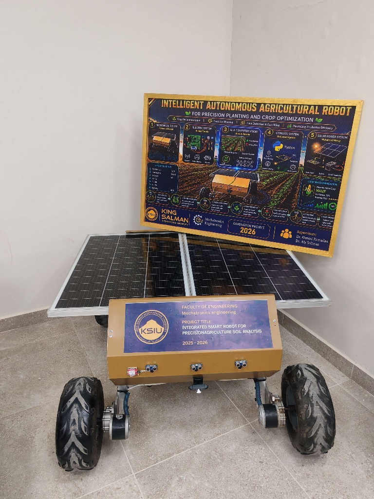
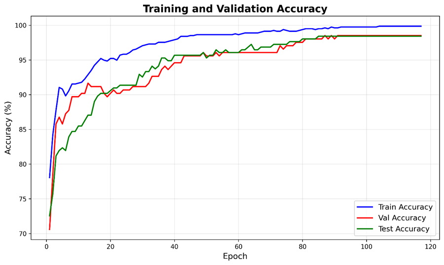
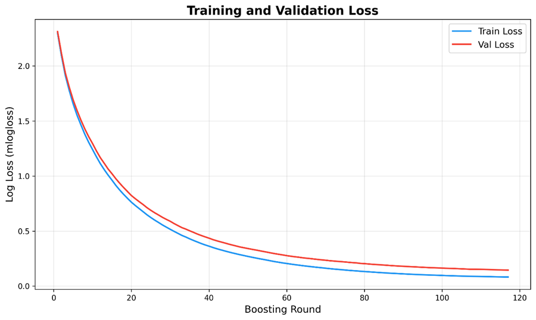
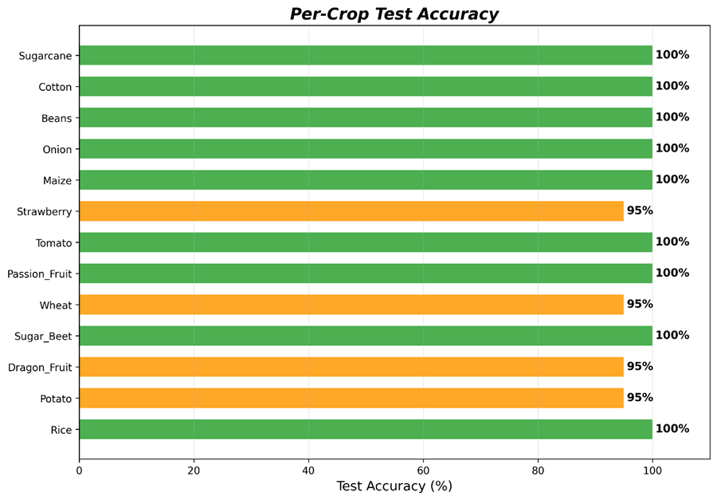

<div align="center">

#  AgriBot — Autonomous Precision Agriculture Robot

### Solar-Powered · AI-Driven · Fully Autonomous

[](.)
[](https://python.org)
[](.)
[](.)
[](https://huggingface.co/spaces/Mintis/Plant-Detection-App)
[](LICENSE)

<br>

*A solar-powered field robot that autonomously analyzes soil conditions, recommends the optimal crop, precision-plants seeds, and comes back to check on them — replanting where needed. No human intervention required.*

**King Salman International University · Mechatronics & Robotics Engineering · 2025–2026**

<br>



<br>

[Features](#-features) · [Architecture](#-system-architecture) · [AI Pipeline](#-ai-pipeline) · [Results](#-results) · [Live Demo](#-live-demo) · [Setup](#-setup) 
---

</div>

##  The Problem

Traditional farming in Egypt relies on manual labor, guesswork for crop selection, and reactive (not proactive) replanting. Farmers lose significant yield when seedlings fail and aren't replaced in time. There is no accessible, localized AI system that understands Egyptian soil conditions and crop requirements.

##  My Solution

A complete **autonomous precision agriculture system** that:
1. **Reads** real-time soil data (pH, EC, temperature, humidity, NPK)
2. **Recommends** the optimal crop using AI trained on Egyptian-specific data
3. **Plants** seeds with centimeter-level GPS precision
4. **Returns** after a user-defined period to check on crops
5. **Replants** autonomously wherever seedlings have failed

All powered by **solar energy** for sustainable, off-grid field operation.

---

##  Features

| Feature | Description |
|---------|-------------|
|  **AI Crop Recommendation** | XGBoost model analyzing soil & climate data → 98.4% accuracy across 13 Egyptian crops |
|  **Computer Vision** | YOLOv26s plant detection trained on 43,000+ curated images |
|  **Autonomous Replanting** | Robot identifies empty planting slots and replants without human intervention |
|  **Solar Powered** | Integrated solar panel charging system for sustainable off-grid operation |
|  **Web Dashboard** | Real-time sensor monitoring, AI recommendations, and fertilizer prescriptions |
|  **GPS Navigation** | Centimeter-level precision for seed placement and return navigation |
|  **Soil Treatment** | Automated pH/EC correction recommendations following FAO standards |
|  **NPK Prescriptions** | Growth-stage-specific fertilizer dosing for each recommended crop |

---

##  System Architecture

```
┌──────────────────────────────────────────────────────────────────────┐
│                    AUTONOMOUS AGRICULTURE ROBOT                      │
│                                                                      │
│  ┌─────────────┐    ┌──────────────┐    ┌─────────────────────────┐  │
│  │  SENSOR      │    │  AI ENGINE   │    │  ACTUATION SYSTEM      │  │
│  │  MODULE      │───▶│              │───▶│                       │  │
│  │             │    │  ┌──────────┐ │    │  • Seed Dispenser      │  │
│  │  • pH       │    │  │ XGBoost  │ │    │  • GPS Navigation      │  │
│  │  • EC       │    │  │ Crop Rec │ │    │  • Motor Controllers   │  │
│  │  • Temp     │    │  └──────────┘ │    │  • Planting Mechanism  │  │
│  │  • Humidity │    │  ┌──────────┐ │    │                        │  │
│  │  • NPK      │    │  │ YOLOv26s │ │    └────────────────────────┘  │
│  │             │    │  │ Plant    │ │                                 │
│  └─────────────┘    │  │ Detect   │ │    ┌─────────────────────────┐  │
│                     │  └──────────┘│     │  POWER SYSTEM           │  │
│  ┌─────────────┐    │  ┌──────────┐ │    │                         │  │
│  │  CAMERA     │──▶│  │Replanting│ │    │   Solar Panel            │  │
│  │  MODULE     │    │  │ Logic    │ │    │   Battery               │  │
│  └─────────────┘    │  └──────────┘ │    │   Charge Controller     │  │
│                     └───────────────┘    └─────────────────────────┘  │
│                                                                       │
│  ┌──────────────────────────────────────────────────────────────────┐ │
│  │  COMMUNICATION: ESP32 (Wi-Fi) ←→ Raspberry Pi 5 ←→ Web Dashboard│  │
│  └──────────────────────────────────────────────────────────────────┘ │
└───────────────────────────────────────────────────────────────────────┘
```

---

##  AI Pipeline

### Module 1: XGBoost Crop Recommendation System

> **The hardest part:** There is no Kaggle dataset for "what grows best in Nile Delta soil at pH 7.8." I had to read 60+ Arabic Ministry of Agriculture PDFs, cross-reference with FAO data, and build every parameter from the ground up.

```
Soil Sensors → Feature Engineering → XGBoost Model → Top-N Crop Ranking
                                          │
                                          ├── Quality Score (Gaussian)
                                          ├── pH Treatment Engine
                                          ├── EC Treatment Engine (FAO Method)
                                          └── NPK Fertilizer Prescription
                                               └── Per Growth Stage Dosing
```

**Key Achievements:**
-  **98.4% validation accuracy** across 13 Egyptian crops (1,300 samples)
-  Benchmarked against **15 ML algorithms** — XGBoost selected for best accuracy-speed balance
-  Custom dataset curated from **60+ Egyptian Ministry of Agriculture** bulletins
-  Full **fertilization prescriptions** per crop per growth stage (Seedling → Maturity)
-  pH/EC soil correction using FAO-approved treatment methods

<br>

| Metric | Value |
|--------|-------|
| Validation Accuracy | **98.4%** |
| Number of Crops | 13 Egyptian crops |
| Dataset Size | 1,300 samples |
| Features | EC, pH, Temperature, Humidity |
| Training Epochs | 120 boosting rounds |
| Model Size | < 1 MB |

**Training & Validation Accuracy:**



**Training & Validation Loss:**



**Per-Crop Test Accuracy:**




---

### Module 2: YOLOv26s Plant Detection Model

Real-time computer vision model that detects **seedlings** and **empty planting slots** for autonomous replanting decisions.

```
Camera Frame → YOLOv26s Inference → Bounding Boxes
                                        │
                                        ├── "planted" (healthy seedling)
                                        └── "empty"   (needs replanting)
                                              │
                                              └── Trigger Replanting Mechanism
```

**Key Achievements:**
-  Trained on **43,000+ cleaned and curated images** (3 agricultural datasets merged)
-  **500 training epochs** on Kaggle GPU infrastructure
-  Advanced data cleaning pipeline removing mislabeled/duplicate images
-  **ONNX export** for Raspberry Pi 5 edge deployment
-  Live demo deployed on **Hugging Face Spaces**

<details>
<summary><b> Training Results (Click to Expand)</b></summary>
<br>

| Metric | Value |
|--------|-------|
| Validation Accuracy | **98.4%** |
| Number of Crops | 13 Egyptian crops |
| Dataset Size | 1,300 samples |
| Features | EC, pH, Temperature, Humidity |
| Training Epochs | 120 boosting rounds |
| Model Size | < 1 MB |

**Training & Validation Accuracy:**

<!-- Replace with your actual image path when pushing to GitHub -->


**Training & Validation Loss:**


**Per-Crop Test Accuracy:**


</details>
---

### Module 3: Autonomous Replanting Pipeline

The decision engine that connects computer vision to physical action — **the robot's brain**.

```
Timer Expires → Camera Scan → YOLOv26s Analysis
                                    │
                          ┌─────────┴──────────┐
                          │                      │
                    [Seedling Found]        [Empty Slot]
                          │                      │
                      Skip Slot            Navigate via GPS
                                                 │
                                          Dispense & Plant Seed
                                                 │
                                           Log & Continue
```

**How it works:**
1. After a user-defined growth period, robot returns to the planting area
2. Onboard camera captures the planting grid
3. YOLOv26s classifies each slot as "planted" or "empty"
4. Decision engine triggers autonomous replanting at empty positions
5. GPS-guided navigation ensures centimeter-level precision
6. Process maximizes soil utilization without any human intervention

---

##  Results

<div align="center">

| Component | Metric | Result |
|-----------|--------|--------|
|  Crop Recommendation | Validation Accuracy | **98.4%** |
|  Crop Recommendation | Number of Crops | **13 Egyptian crops** |
|  Crop Recommendation | Data Sources | **60+ Ministry bulletins** |
|  Plant Detection | mAP50 | **92.84%** |
|  Plant Detection | Dataset Size | **43,000+ images** |
|  Plant Detection | Training Duration | **500 epochs** |
|  Edge Deployment | Inference (ONNX, RPi5) | **~350ms/image** |
|  Power System | Energy Source | **solar charging the battery** |

</div>

---

##  Live Demo

Try the plant detection model right in your browser — no installation needed!

** [Launch on Hugging Face Spaces](https://huggingface.co/spaces/Mintis/Plant-Detection-App)**

Upload a photo of a plant or use your webcam. The model will detect seedlings and empty planting slots in real-time.

---

##  Setup

### Prerequisites
```bash
Python >= 3.10
pip install xgboost scikit-learn numpy pandas matplotlib
pip install ultralytics opencv-python onnxruntime
```

### Crop Recommendation System
```bash
# Run the recommendation engine
python crop_recommendation_system.py

# Launch the web dashboard
python dashboard.py
```

### Plant Detection (YOLOv26s)
```bash
# Run inference on an image
python detect.py --source image.jpg --weights best.onnx

# Run live webcam detection
python webcam_detect.py --camera 0
```

---

##  Project Structure

```
AgriBot/
├──  ai-engine/
│   ├── crop_recommendation_system.py   # Full recommendation pipeline (667 lines)
│   ├── egypt_crop_database.py          # Localized Egyptian crop database
│   ├── egypt_crop_model_v5.json        # Trained XGBoost model
│   ├── label_encoder.pkl               # Label encoder for crop classes
│   └── dashboard.py                    # Web-based monitoring dashboard
│
├──  vision/
│   ├── train.py                        # YOLOv26s training script
│   ├── detect.py                       # Inference script
│   ├── webcam_detect.py                # Live webcam detection
│   └── best.onnx                       # Exported ONNX model
│
├──  assets/                          # Charts, training curves, screenshots
├──  docs/                            # Technical documentation
└── README.md
```

---


**Supervised by:** Dr. Ahmed Ramadan & Dr. Aly Soliman

---

##  Academic Context

- **University:** King Salman International University (KSIU)
- **Department:** Mechatronics & Robotics Engineering
- **Project Grade:** A+
- **Duration:** September 2025 — June 2026
- **Competition:** Featured in Egypt TechMakers Challenge

---

##  Acknowledgements

- Egyptian Ministry of Agriculture for the 60+ advisory bulletins used to build the crop database
- FAO for the EC treatment methodology
- Kaggle community for GPU infrastructure
- Ultralytics for the YOLO framework
- Hugging Face for model hosting

---

<div align="center">

###  If this project helped or inspired you, consider giving it a star!


</div>
